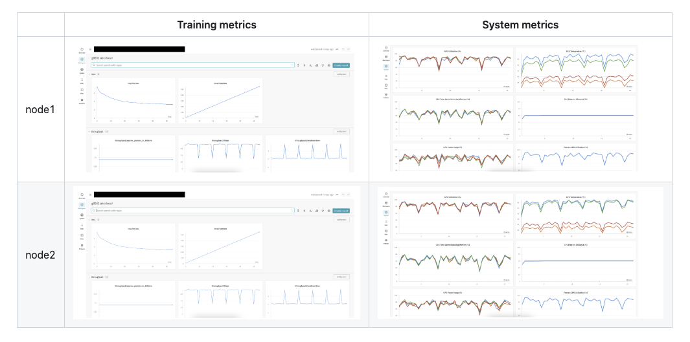

# hotsuyuki

<!--
**hotsuyuki/hotsuyuki** is a ✨ _special_ ✨ repository because its `README.md` (this file) appears on your GitHub profile.

Here are some ideas to get you started:

- 🔭 I’m currently working on ...
- 🌱 I’m currently learning ...
- 👯 I’m looking to collaborate on ...
- 🤔 I’m looking for help with ...
- 💬 Ask me about ...
- 📫 How to reach me: ...
- 😄 Pronouns: ...
- ⚡ Fun fact: ...
-->

## Resume

[View resume (PDF)](https://hotsuyuki.github.io/hotsuyuki/Hotsuyuki_Kawanishi_resume.pdf)

## Projects

### 🧠 AI, Deep Learning, Machine Learning 

| ___________________________________ |  |
| :---: | :--- |
|  | [C++ Deep Learning Framework from Scratch](https://github.com/hotsuyuki/tensorward)    Keywords: *C++, Bazel, Object-Oriented Programming, Unit Testing*    * PyTorch-like deep learning framework architected and implemented from scratch in C++, e.g. layers, optimizers, and autograd. |
|  | [LLM Distributed Training Pipeline](https://github.com/matsuolab/ucllm_nedo_prod?tab=readme-ov-file#contributors)    Keywords: *Python, Shell Script, DeepSpeed, Transformers, Distributed Systems*    * Scalable distributed training pipeline for LLMs on GPU clusters using DeepSpeed ZeRO, 3D Parallelism, and Transformers. |
|  | [HuggingGPT using GPT Function Calling](https://github.com/hotsuyuki/HuggingGPT-function-calling)    Keywords: *TypeScript, React, Python, FastAPI, Azure, OpenAI API*    * Agentic AI prototype to interact with various Hugging Face APIs through natural language utilizing GPT Function Calling. |
|  | [YOLOv5 Object Detection Model in PyTorch C++](https://github.com/hotsuyuki/YOLOv5_PyTorch_cpp)    Keywords: *C++, PyTorch, Convolutional Neural Network*    * YOLOv5 implementation in PyTorch C++ (LibTorch) instead of PyTorch Python for efficient integration in C++ applications. |

### 🤖 Robotics, Self-Driving Car

| ___________________________________ |  |
| :---: | :--- |
|  | [Robotics Algorithms in Jupyter Notebook](https://github.com/hotsuyuki/IpynbRobotics)    Keywords: *Python, Robotics, SLAM, Localization, Path Planning*    * Python codes for robotics algorithms, e.g. Simultaneous Localization & Mapping (SLAM), localization, and path planning. |
|  | [Graph-Based SLAM Paper with C++ and Python Code](https://github.com/hotsuyuki/Graph-Based-SLAM)    Keywords: *C++, Python, Robotics, Graph-based SLAM*    * Detailed mathematical explanation of Graph-Based SLAM with sample code in both C++ and Python for a comprehensive guide. |

### 🥽 AR, MR, VR, XR

| ___________________________________ |  |
| :---: | :--- |
|  | [AR Multiplayer Tic-Tac-Toe Game](https://github.com/hotsuyuki/niantic_lightship_tictactoe)    Keywords: *C#, Unity, Niantic ARDK (Niantic Spatial Platform SDK)*    * AR Tic-Tac-Toe game that is played with 2 mobile devices sharing a synchronized virtual board for an immersive experience. |
